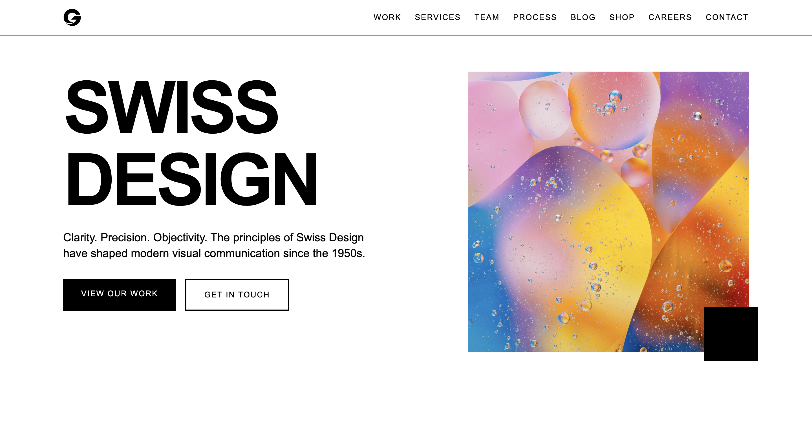

# Swiss Design Studio

> A modern design studio website built with Next.js 15, React 19, and Tailwind CSS, echoing the timeless principles of Swiss Design (International Typographic Style).

<p align="center">
  
</p>

<p align="center">
  
</p>

## 🎨 Design Philosophy

This project embodies the core principles of Swiss Design:
*   **Clarity & Precision**: Objective visual communication.
*   **Grid Systems**: Mathematical structure for content layout.
*   **Typography**: Strong reliance on sans-serif fonts (Inter) for readability.
*   **Minimalism**: "Less is more" approach.
*   **Color Palette**: High contrast Black & White with Swiss Red (`#E41E26`) accents.

## 🛠 Tech Stack

*   **Framework**: [Next.js 15.5](https://nextjs.org/) (App Router)
*   **Library**: [React 19](https://react.dev/)
*   **Styling**: [Tailwind CSS](https://tailwindcss.com/)
*   **UI Components**: [Radix UI](https://www.radix-ui.com/) primitives & [Shadcn UI](https://ui.shadcn.com/)
*   **Icons**: [Lucide React](https://lucide.dev/)
*   **Language**: TypeScript

## 📂 Project Structure

```text
├── app/                  # Next.js App Router root
│   ├── blog/             # Blog listings and articles
│   ├── components/       # Global application components
│   ├── projects/         # Case studies and portfolio
│   └── services/         # Services descriptions
├── components/           # Reusable React components
│   └── ui/               # Shadcn / Radix primitives
├── lib/                  # Global utility functions
└── public/               # Static assets (images, icons)
```


## 🚀 Getting Started

1.  **Install dependencies**:
    ```bash
    npm install
    # or
    pnpm install
    # or
    yarn
    ```

2.  **Run the development server**:
    ```bash
    npm run dev
    ```

3.  **Open the application**:
    Navigate to [http://localhost:3000](http://localhost:3000) in your browser.

## 🧩 Key Features

*   **Responsive Layout**: Fully adaptive design for mobile, tablet, and desktop.
*   **Component Library**: Built with reusable, accessible components using Radix UI.
*   **Theming**: Custom Tailwind configuration for the Swiss Design aesthetic.
*   **Performance**: Optimized with Next.js server components and image optimization.

## 📝 Customization

### Colors
The primary color palette is defined in `tailwind.config.js` and `app/globals.css`. The distinctive Swiss Red is configured as `red-600` (`#E41E26`).

### Typography
The project uses the **Inter** font family, configured via `next/font/google` in `app/layout.tsx`.

## 📄 License

This project is private and proprietary.
